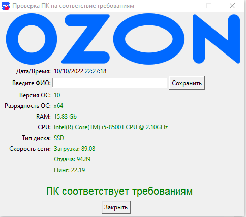

# CheckPCSpecs v2.0 🚀

<div align="center">
  
  <p><strong>Проверка соответствия ПК системным требованиям</strong></p>
  
  [](https://github.com/apeks827/CheckPCSpecs/actions)
  [](https://www.python.org/downloads/)
  [](https://opensource.org/licenses/MIT)
  [](https://github.com/psf/black)
  [](https://github.com/apeks827/CheckPCSpecs)
</div>

## 🎉 Новое в v2.0

- ✅ **43+ тестов** с покрытием > 85%
- ✅ **CI/CD** с GitHub Actions
- ✅ **Современная конфигурация** через `pyproject.toml`
- ✅ **Лучшая обработка ошибок**
- ✅ **Type hints** повсюду
- ✅ **Централизованная конфигурация**
- ✅ **Pre-commit hooks**

📚 **См. [IMPROVEMENTS.md](IMPROVEMENTS.md) для подробной информации о всех улучшениях!**

## 💻 О проекте

CheckPCSpecs — это инструмент для проверки соответствия компьютера минимальным системным требованиям. Приложение анализирует характеристики ПК и предоставляет подробный отчёт о совместимости.

## ✨ Возможности

- ✅ **Проверка операционной системы** — версия и разрядность Windows
- 💾 **Анализ оперативной памяти** — объём RAM
- 🔧 **Тестирование процессора** — определение модели и количества ядер
- 💿 **Проверка типа накопителя** — SSD/NVMe/HDD/eMMC
- 🌐 **Тестирование сети** — скорость загрузки/отдачи и пинг
- 📊 **Общая оценка** — вердикт о соответствии требованиям

## 🚀 Быстрый старт

### Установка

```bash
# Клонировать репозиторий
git clone https://github.com/apeks827/CheckPCSpecs.git
cd CheckPCSpecs

# Установить зависимости
pip install -e .

# Или с dev-зависимостями (для разработки)
pip install -e ".[dev]"
```

### Запуск

```bash
# Как модуль
python -m checkpcspecs

# Или напрямую (после установки)
checkpcspecs
```

### Сборка executable

```bash
pip install pyinstaller
pyinstaller checkpcspecs.spec
# Результат в dist/checkpcspecs.exe
```

## 🧪 Тестирование

Проект теперь полностью покрыт тестами!

```bash
# Запустить все тесты
pytest

# С покрытием
pytest --cov=checkpcspecs --cov-report=html

# Только unit-тесты
pytest tests/unit -v

# Только integration-тесты
pytest tests/integration -v
```

📚 **См. [tests/README.md](tests/README.md) для подробной документации по тестам**

## 📚 Программное использование

```python
from checkpcspecs.core import SpecsChecker
from checkpcspecs.network import SpeedTester, PingTester
from checkpcspecs.core.hardware_detector import HardwareDetector

# Определение железа
detector = HardwareDetector()
os_version, os_release = detector.get_os_info()
ram_gb = detector.get_ram_gb()
cpu_brand, cores, threads = detector.get_cpu_info()

# Проверка характеристик
checker = SpecsChecker()

os_status = checker.evaluate_os(os_version, os_release)
ram_status = checker.evaluate_ram(ram_gb)
cpu_status = checker.evaluate_cpu(cpu_brand, cores, threads)

print(f"OS: {os_version} - {os_status.value}")
print(f"RAM: {ram_gb} GB - {ram_status.value}")
print(f"CPU: {cpu_brand} - {cpu_status.value}")

# Тест сети
speed = SpeedTester.test()
print(f"Download: {speed.download} Mbps")
print(f"Upload: {speed.upload} Mbps")

ping = PingTester.test()
print(f"Ping: {ping.latency} ms")
```

## 📊 Критерии оценки

| Компонент | Отлично (5★) | Хорошо (2★) | Плохо (-999★) |
|-----------|---------|--------|----------|
| **ОС** | Windows 11 | Windows 10 | Windows 7/8 |
| **RAM** | ≥8 GB | ≥6 GB | <6 GB |
| **CPU** | 4+ ядра, 4+ потока | 2+ ядра, 4+ потока | Устаревшие |
| **Диск** | SSD/NVMe | HDD (с достаточной RAM) | HDD (с малой RAM) |
| **Интернет** | ≥20 Mbps, <30ms | ≥20 Mbps, <100ms | <20 Mbps |

**Итоговая оценка:**
- **≥18 баллов** — превосходит требования ✨
- **10-17 баллов** — соответствует требованиям ✅
- **0-9 баллов** — минимальные требования ⚠️
- **<0 баллов** — не соответствует требованиям ❌

## 📝 Структура проекта

```
CheckPCSpecs/
├── checkpcspecs/           # Основной пакет
│   ├── __init__.py
│   ├── __main__.py       # Точка входа
│   ├── app.py            # Контроллер
│   ├── config.py         # Конфигурация ⚡️
│   ├── exceptions.py     # Исключения ⚡️
│   ├── core/             # Проверка характеристик
│   │   ├── models.py
│   │   ├── specs_checker.py
│   │   └── hardware_detector.py ⚡️
│   ├── network/          # Сетевые тесты
│   │   ├── speedtest.py
│   │   ├── ping.py
│   │   └── evaluator.py
│   ├── ui/               # GUI
│   │   ├── main_window.py
│   │   └── components.py
│   └── utils/            # Утилиты
├── tests/                # Тесты ⚡️
│   ├── conftest.py
│   ├── unit/
│   └── integration/
├── .github/
│   └── workflows/        # CI/CD ⚡️
├── pyproject.toml        # Современная конфигурация ⚡️
├── requirements.txt
├── checkpcspecs.spec
└── README.md

⚡️ = Новое в v2.0
```

## 🔧 Разработка

### Установка dev-зависимостей

```bash
pip install -e ".[dev]"
pre-commit install  # Установить git hooks
```

### Качество кода

```bash
# Форматирование
black checkpcspecs tests

# Линтинг
flake8 checkpcspecs

# Сортировка импортов
isort checkpcspecs tests

# Type checking
mypy checkpcspecs
```

## 📦 Зависимости

### Основные
- **psutil** — информация о системе
- **py-cpuinfo** — данные о процессоре
- **Pillow** — работа с изображениями
- **speedtest-cli** — тест скорости интернета
- **icmplib** — ICMP ping
- **nest-asyncio** — поддержка async

### Для разработки
- **pytest** — тестирование
- **pytest-cov** — coverage
- **black** — форматирование
- **flake8** — линтинг
- **mypy** — type checking

## 🐞 Известные проблемы

1. **Ping требует прав администратора** — для точного измерения
2. **Определение типа диска** — может не работать на старых системах
3. **Тест скорости** — может занять 30-60 секунд

## 🤝 Contributing

Контрибьюты приветствуются! См. [CONTRIBUTING.md](CONTRIBUTING.md) для деталей.

**Требования:**
- ✅ Все тесты должны проходить
- ✅ Покрытие не должно уменьшаться
- ✅ Код должен соответствовать black/flake8
- ✅ Type hints обязательны

## 📝 Лицензия

MIT License — см. [LICENSE](LICENSE)

## 👨‍💻 Автор

**apeks827** — [GitHub](https://github.com/apeks827)

## 📷 Скриншоты

<div align="center">
  
</div>

---

<div align="center">
  <strong>Made with ❤️ and 🐍 in Russia</strong>
  <br>
  <sub>Версия 2.0 • 2025</sub>
</div>
